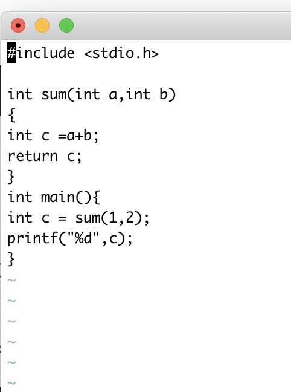
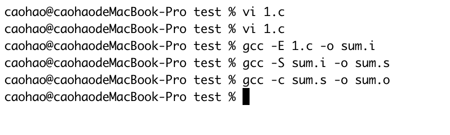

## Shell基础

Shell就是一个命令解释器，将我们的命令解释给Linux内核，其实我们平时打命令的界面就是Shell他的功能呢就是给我们一个可以与系统交互的界面

Shell是解释执行的脚本语言，不需要编译，所见即所得。

sh 进入bash  bshell


## Shell编程

$? 显示上一个命令的执行状态

$(#name) 统计字符长度

Expr length "$name". 也是统计字符长度

${name:2} 字符的截取 从第二个开始截取

${name:2:2} 从第二个开始截取截取两个

双小括号

$((1+2)) 用于计算

变量输入

read -t 10 -p "please input one num": num

输入一个数字传给num


协议个计算器

```
#!/bin/bash
#该脚本是写一个简单的计算器

read -p "请输入第一个数字" x
read -p "请输入第二个数字" y
read -p "请输入运算符号" f

#最外层判断，判断输入的是否为空
# -n 判断 是否为非空
# -a 多重条件判断 与
if [ -n "$x" -a -n "$y" -a -n "$f" ]
        then
# 下面这个表达式用于判断输入的两个字符是否完全为数字，反引号 和 $()为同一个作用，将系统命令的值赋给变量，原理为，输出变量x的值，并利用管道符，将该值进行字符串替换， sed "s/旧字符串/新字符串/g"，末尾g表示将指定范围内的所有旧字符串都替换，所以虽然[0-9]表示匹配一个字符，加了g以后，会替换所有字符。
                test1=`echo "$x" | sed "s/[0-9]//g"`
                test2=$(echo "$y" | sed "s/[0-9]//g")
#中间的判断，判断输入的两个值是否为数字
            if [ -z "$test1" -a -z "$test2" ]
                    then
# 最内层判断，判断是什么运算符号
                            if [ "$f" == "+" ]
                                    then
                                    echo "$x和$y的和是"$[$x+$y]
                            elif [ "$f" == "-" ]
                                    then
                                    echo "$x和$y的差是"$[$x-$y]
                            elif [ "$f" == "*" ]
                                    then
                                    echo "$x和$y的积是"$[$x*$y]
                            elif [ "$f" == "/" ]
                                    then
                                        echo "$x和$y的商是"$[$x/$y]
                            fi
            else
                    echo "您输入的不是数字，重新执行脚本"
                    bash jisuanqi.sh
                    exit 2
            fi
    else
            echo "您没有输入数字，重新执行脚本"
            bash jisuanqi.sh
            exit 1
fi


```

[表达式] && echo true || echo false

-eq 相等 -ne 不等 -gt 大于 -lt小于

-ge 大于等于 -le小于等于

比较推荐用[]

1.if[]

then


else


Fi

2.if[]

then


elif

then


else


fi

实现一个模拟脚本

```
#!/bin/bash
echo 1.install jdk
echo 2.install mysql
echo 3.exit
read -p "pls input the num you want" index
if [ "$index" == "1" ]
 then
touch 1.sh
echo "echo jdk is install" > 1.sh
bash 1.sh
elif [ "$index" == "2" ]
 then
touch 2.sh
echo "echo mysql is installed" > 2.sh
bash 2.sh
elif [ "$index" == "3" ]
 then
exit 1
fi
~
```

### 循环语句

```
while true
do
        uptime
        sleep 2
done
```

循环输出到控制台

```
#!/bin/bash
i=5
while [ $i -gt 0 ]
do
        echo $i
        ((i-=1))
done
```

循环自减5次并输出到控制台

```
#!/bin/bash
i=100
sum=0
while [ $i -gt 0 ]
do
        ((sum+=i))
        ((i=i-1))
done
echo $sum
```

输出1到100的累加和

For 语句

For var in list 

do 

....

done

```
#!/bin/bash
for num in {1..20}
do
        echo $num
done
```

循环输出1到20

```
#!/bin/bash
for x in `seq 9`
do
        for y in `seq 9`
        do
                echo -n $((x*y))
                echo -n "  "
        done
        echo " "
done
```

输出99乘法表  其中·seq 9·表示是从1到9的数组

其中 echo -n 是表示不换行

还有-e是表示转义这里没有用到


#!/bin/bash
for filename in *.txt
do
        mv $filename $(echo $filename | cut -d . -f 1).doc;
done

输出当前文件夹下文件和目录的个数

```
caohao@caohaodeMacBook-Pro test % vi a.sh
#!/bin/bash
filenum=0
dirnum=0

for i in $( ls )
do
   if [ -d $i ]
   then
      ((dirnum += 1))
   else
      ((filenum += 1))
   fi
done

echo "$dirnum"
echo "$filenum"
```


查看用户个数

```
#!/bin/bash
file="/etc/passwd"
LINES=`wc -l $file | cut -d" " -f1`
for I in `seq 1 $LINES`;do
userid=`head -$I $file | tail -1 |cut -d: -f3`
username=`head -$I $file | tail -1 |cut -d: -f1`
echo "hello $username,your UID is $userid"
done
echo "there are $LINES users"
```

我们需要建立m1.txt，m2.txt。。。。。m9.txt，我们希望把这些文件移动新的文件夹，m1/m1.txt，m2/m2.txt touch mv

```
#!/bin/bash
touch m{1..9}.txt
mkdir m{1..9}
for i in `seq 1 9`;
do
        mv m${i}.txt m${i}
done
~
~
```


$$

$$

## Linux c环境编程

c语言是Linux的核心语言

通过gcc [opation] filename编译c文件

1. 预处理
2. 编译-》汇编文件
3. 汇编-〉目标文件
4. 连接-》可执行文件

预处理的选项 -E

编译成汇编文件 -S

编译成目标文件 -C

编译成可执行文件 gcc -o hello 1.c 

下面写一个计算两个数字和的代码按照上面的步骤编译下来





gcc  sum.o -o sum 编译为可执行文件sum

./sum运行可执行文件

