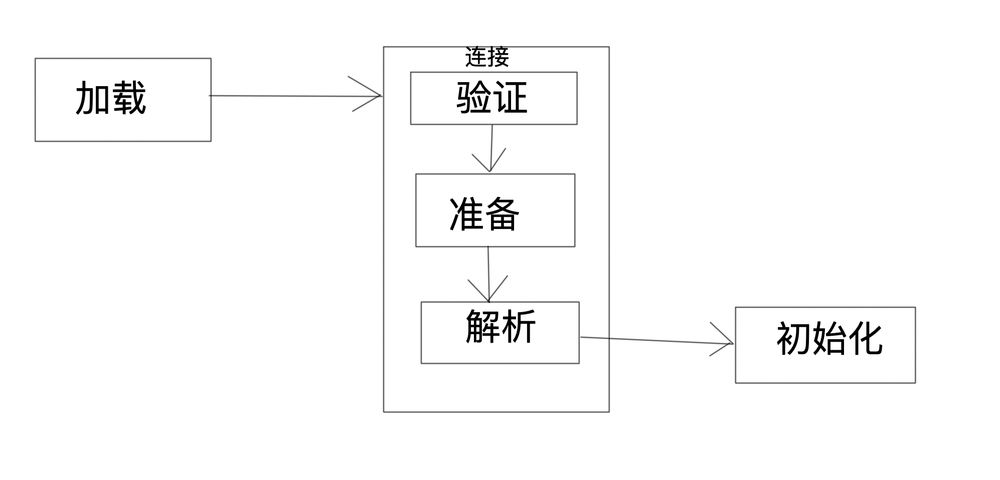
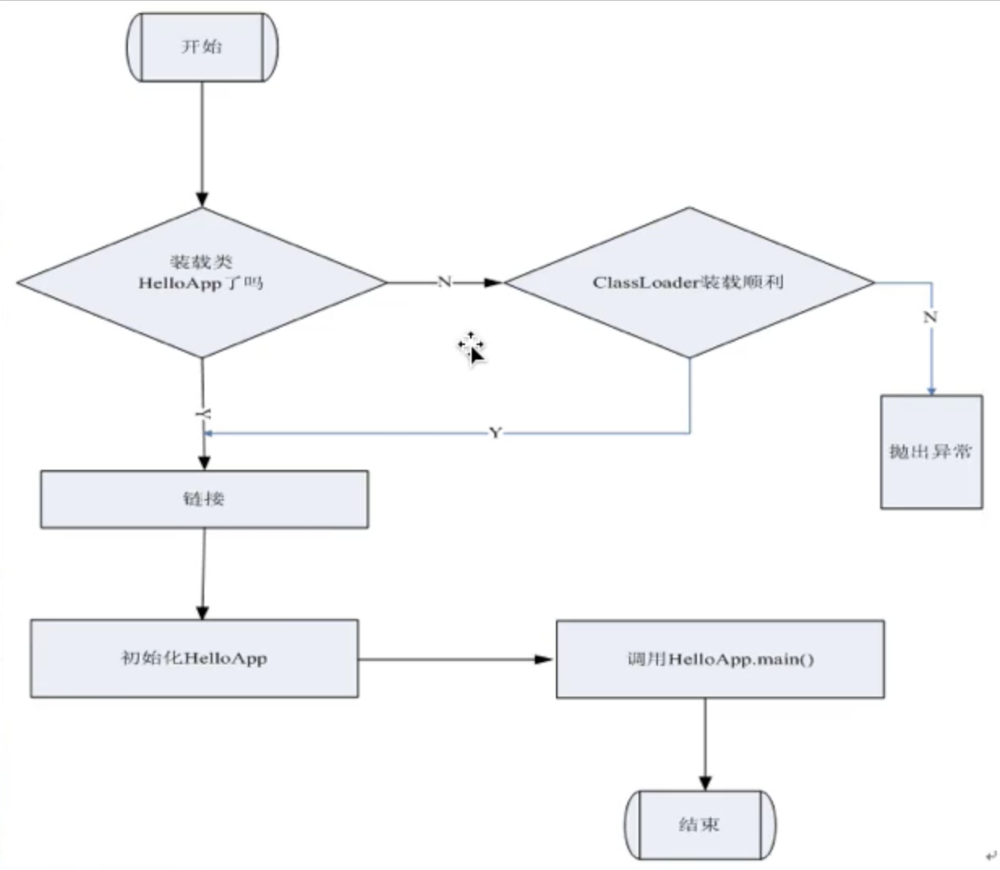
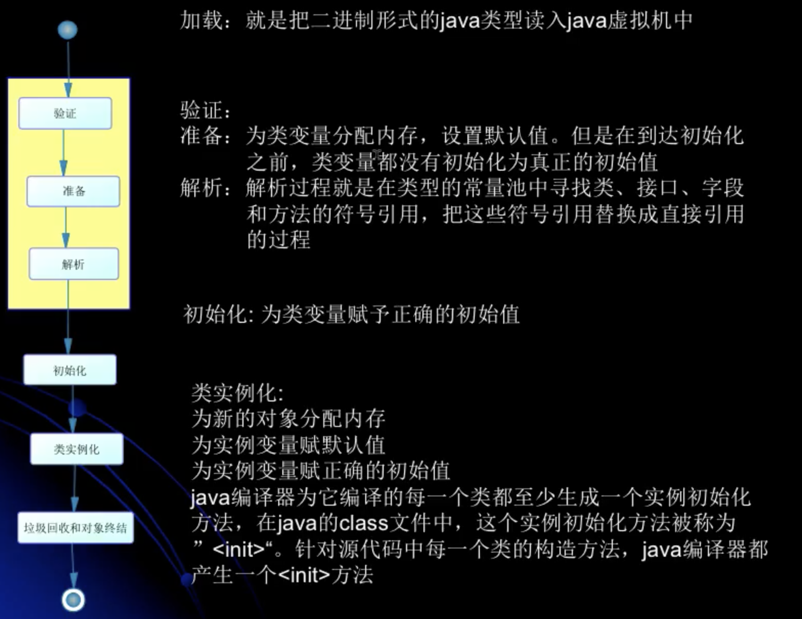
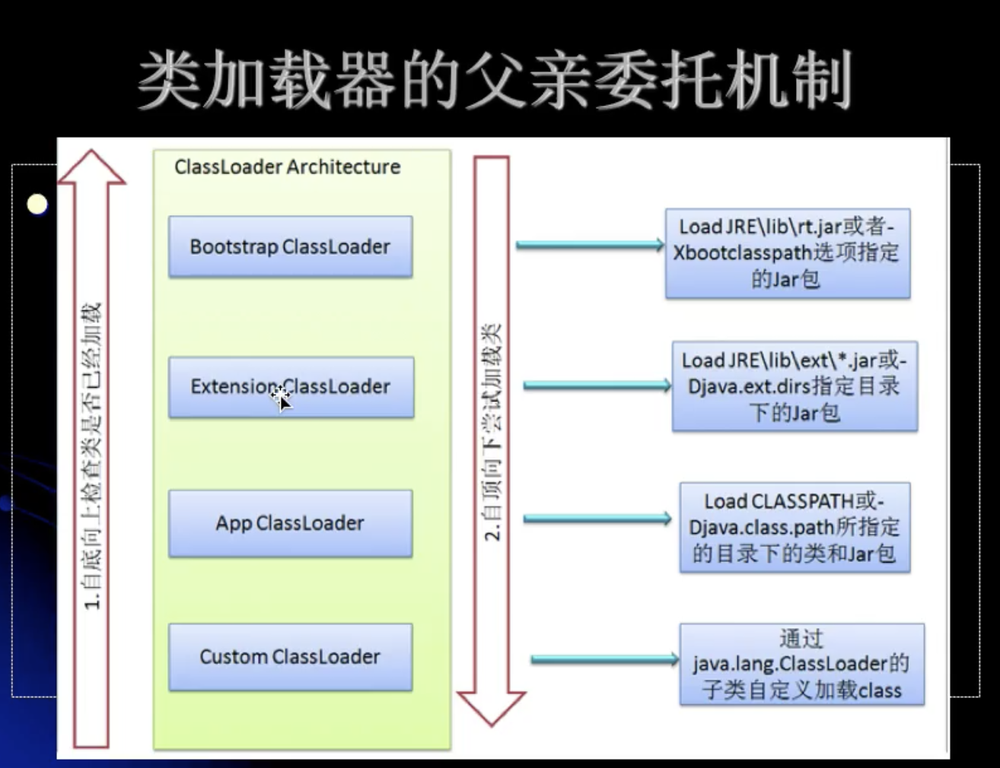
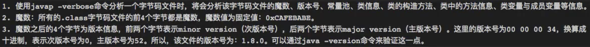
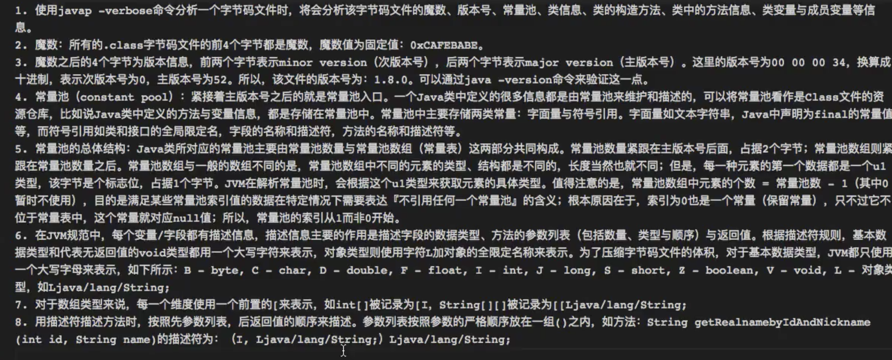

[TOC]


# 深入理解jvm

使用jconsole通过命令行我们可以直接打开这个管理工具，这个是jdk自带的工具

Jvisualvm 这个工具也是一个自带的一个工具

## 类加载器机制

在Java代码中，类形的加载，连接和初始化过程都是在程序运行期间完成的



Java程序对类的使用方式分为两种

1. 主动使用
2. 被动使用

所有Java虚拟机实现必须要在每个类或者接口被Java程序**首次主动使用**时才初始化

### 主动使用

1. 创建类的实例
2. 访问某个类或者接口的静态变量，或者对静态变量赋值
3. 调用静态方法
4. 反射（如class.forname）
5. 初始化一个类的子类也会先初始化这个类
6. 被Java虚拟机标记为启动类的类（如java test）

类的加载是指将类的.class文件中的二进制数据读入内存中，将它放入到运行时数据区的方法区中，然后创建一个Java.lang.class对象，用来封装类在方法区内的数据结构

```java
public class MyService {
    public static void main(String[] args) {
        System.out.println(child.str);
    }
}
class parent{
    static {
        System.out.println("parent loading");
    }
    public static String str = "parent str";
}
class child extends parent{
    static {
        System.out.println("child loading");
    }
    public static String str = "child str";
}


结果：
  parent loading
child loading
child str
```

从上面的代码的运行结果可以看出来，在主动使用一个类时会将他的全部上层类都初始化，最后在初始化这个类

我们再加入一个jvm参数看一下 -XX:+TraceClassLoading

jvm参数有三种

1. -XX:+<option>
2. -XX:-<option>
3. -XX:<option>=<value>

看一下类的加载是在什么时候完成的

我们这次将对child类的静态变量的调用取消了，也就是我们除了我们的启动类以外不在主动使用任何一个类，我们还是会发现jvm加载了我们所有的类，也就是说类的加载大部分都发生在运行开始是

### 常量的本质

常量会在编译期间存入到调用这个常量的方法的类的常量池中，而不是调用定义了这个常量的类，索引不是主动使用定义了这个常量的类

```java
public class MyService {
    public static void main(String[] args) {
        child.get();
    }
}
class parent{
    static {
        System.out.println("parent loading");
    }
    public static final String str = "parent str";
}
class child {
    static {
        System.out.println("child loading");
    }
    public static void get(){
        System.out.println(parent.str);
    }
}

> Task :MyService.main()
        child loading
        parent str
```

可以看到我们调用了child类中的get方法这个方法内部调用的是parent类定义的常量，但是我们运行时并不会初始化parent类而是初始化child类，这验证了我们上面的结论

即便我们将parent类的class文件删除也不会影响我们上面那个程序的运行

接下来我们反编译一下看看这个类到底是什么样子的

Javap -c classname

```
public class com.nettylearn.Service.MyService {
  public com.nettylearn.Service.MyService();
    Code:
       0: aload_0
       1: invokespecial #1                  // Method java/lang/Object."<init>":()V
       4: return

  public static void main(java.lang.String[]);
    Code:
       0: invokestatic  #2                  // Method com/nettylearn/Service/child.get:()V
       3: return
}

```

我们可以明显的看到使用的是child的常量池

也就是说实在类的连接阶段对静态变量分配了内存并初始化默认值，而不是在加载阶段

### 编译期常量于运行期常量以及创建数组的本质

```java
public class jvmtest1 {
    public static void main(String[] args) {
        System.out.println(testparent.str);
    }
}
class testparent{
    public static final String str = UUID.randomUUID().toString();

    static {
        System.out.println("parent hellow");
    }
}
```

上面这串代码看起来和前面的没什么区别，也是调用一个类的静态常量，按照前面的逻辑想我们会在编译期将这个常量放到调用这个常量的方法的类的常量池中，是主动使用jvmtest1这个类

我们看一下运行结果

> Task :jvmtest1.main()
> parent hellow
> ca2ec9b3-b85e-4b92-8958-9bfbda5bf15f

原因是因为我们这次设置的常量并不是一个在编译期就能确定的常量就不能放在调用类的常量池中，所以要在运行期间初始化这个类之后才能拥有这个常量

```java
public class jvmtest1 {
    public static void main(String[] args) {
        testparent[] parents = new testparent[1];
    }
}
class testparent{
    public static  String str = UUID.randomUUID().toString();

    static {
        System.out.println("parent hellow");
    }
}
```

这次我们将会new一个对象数组看看他会不会初始化这个类

显然是不会打印的

对于数组实例来说他的类型是在运行期才会生成的

所以不会初始化具体的类

### 接口初始化规则以及初始化顺序

**当一个接口初始化时，不会初始化他的父接口**

**只有在真正使用到父接口的时候才会初始化父接口**

这个原因就在于接口中的变量都会被默认定义为public static final 的常量，所以在我们使用接口时会由jvm自动把常量放入到调用这些接口的类的常量池中，而那些拥有只有在运行期才会获得具体内容的常量的接口由于要将这个常量放入类的常量池所以就会引发对接口的初始化

下面我们在进行一个有趣的代码测试

```Java a
public class jvmtest2 {
    public static void main(String[] args) {
        //1.第一次运行方式,运行结果是  1，1
        System.out.println(Singleton.i1);
        System.out.println(Singleton.i2);
        //2第二次运行方式,运行结果也是1，1
//        Singleton instance = Singleton.getInstance();
//        System.out.println(instance.i1);
//        System.out.println(instance.i2);

        //第三次我们将下面的单利模式注释掉,换成自己的一个公共构造方法，会发现不会调用构造函数了，
    }
}

class Singleton{
    public static int i1;
    public static int i2=0;

    public Singleton(){
        System.out.println(1);
    }

//    private static Singleton singleton = new Singleton();
//
//    private Singleton(){
//        System.out.println("111222");
//        i1++;
//        i2++;
//    }
//    public static Singleton getInstance(){return singleton;}
}
```


```Java a
public class jvmtest2 {
    public static void main(String[] args) {
        //1.第一次运行方式,运行结果是  1，1
//        System.out.println(Singleton.i1);
//        System.out.println(Singleton.i2);
        //2第二次运行方式,运行结果也是1，1
        Singleton instance = Singleton.getInstance();
        System.out.println(instance.i1);
        System.out.println(instance.i2);

        //第三次我们将下面的单利模式注释掉,换成自己的一个公共构造方法，会发现不会调用构造函数了，
        
        
    }
}

class Singleton{
    public static int i1;


//    public Singleton(){
//        System.out.println(1);
//    }

    private static Singleton singleton = new Singleton();

    private Singleton(){
        System.out.println("111222");
        i1++;
        i2++;
    }
    public static int i2=0;
    public static Singleton getInstance(){return singleton;}
}
```

运行结果是

111222

1

0

这样就可以看到准备阶段的意义，因为Java代码毕竟是顺序执行的，所以如果没有准备阶段的这一次赋初值的话那么在初始化阶段就会出现为一个不存在的引用赋值的情况。





类的加载的最终结果就是生成对应的class对象存入方法区。

### 类加载器

类加载器可以分为两种

1. Java虚拟机自带的加载器
   - 根类加载器（bootstarp）
   - 扩展类加载器(extension)
   - 系统类加载器(system)
2. 用户自定义的加载器
   - Java.lang.classloader的子类
   - 用户可以定制类的加载方式

类加载器不会是在首次使用时再加载。那是初始化的过程才会在首次主动使用时初始化

jvm规范允许程序认为某个类将要被使用时预先加载他的类，如果这个类缺少他的字节码文件，再预先加载时也不会报错，只有在第一次主动使用这个类时才会报一个连接错误（linkageerror）

如果一直不使用这个类那么就不会报错。

### 类的连接

连接就是将通过加载读入的二进制文件合并到Java虚拟机的运行时环境当中。

验证的常见内容

- 类文件的结构检查
- 语意检查
- 字节码验证
- 二进制兼容验证
- 魔数验证等等

准备阶段

在准备阶段Java虚拟机会为类的静态变量开辟内存并赋予默认初始值

### 初始化

初始化阶段Java虚拟机会为类的静态变量赋于初始值并执行初始化语句

在程序中静态变量的初始化有两种途径

1. 可以在静态变量声明时赋予一个值
2. 可以在静态代码块赋予初始值

没有初始值的静态变量则保留准备时给予的默认值

初始化的步骤

1. 假如这个类还没有被加载和连接，那么就先去加载和连接
2. 假如这个类有他的父类，那么就先去初始化他的父类（不适用于接口）
3. 假如这个类有初始化语句，那么就按照初始化语句的声明顺序执行初始化语句。

我们调用classloader类的loadclass方法不会使得这个类被初始化，只会加载这个类的文件

### 类加载的双亲委托机制



```java
public class classloadertest {
    public static void main(String[] args) throws Exception {
        Class<?> clazz = Class.forName("java.lang.String");
        System.out.println(clazz.getClassLoader());
        Class<?> clazz2 = Class.forName("com.nettylearn.Service.a");
        System.out.println(clazz2.getClassLoader());
    }
}
class a{
    static {
        System.out.println("a init");
    }
}
```

运行结果

> Task :classloadertest.main()
> null    在某些jvm中会将根加载器的返回为null
> a init
> sun.misc.Launcher$AppClassLoader@2a139a55

### 类加载器与类初始化深度剖析

```java
class parent2{
    static {
        System.out.println("parent static block");
    }
    public static int a=1;
    public static void get(){
        System.out.println("parent method");
    }

}

class child2 extends parent2{
    static {
        System.out.println("child static block");
    }
}

public class calssloadingtest2 {
    public static void main(String[] args) {
        parent2.get();
        System.out.println(parent2.a);
    }
}
```

我们来想一想会不会初始化child呢，通过反编译来看看Java编译出来的助记符是怎么样的

其实经过前面的学习我们应该是可以想出来的，在class lo a dingtest2这个类的编译代码中会是一个invoke #method 指定parent2这个类的全类名，变量也是这样的

```java
class ch{
    static {
        System.out.println("ch static block");
    }
}

public class classloadingtest3 {
    public static void main(String[] args) throws Exception {
        ClassLoader classLoader = ClassLoader.getSystemClassLoader();
        Class<?> aClass = classLoader.loadClass("com.nettylearn.Service.ch");
        System.out.println(aClass);
        System.out.println("--------------");
        Class<?> aClass1 = Class.forName("com.nettylearn.Service.ch");
        System.out.println(aClass1);
    }

}
```

运行结果

class com.nettylearn.Service.ch

ch static block
class com.nettylearn.Service.ch

可以看出来加载器加载这个类时并不会进行初始化

```java
public class classloadertest4 {
    public static void main(String[] args) {
        ClassLoader systemClassLoader = ClassLoader.getSystemClassLoader();
        while (systemClassLoader.getParent()!=null){
            System.out.println(systemClassLoader.getParent());
            systemClassLoader=systemClassLoader.getParent();
        }
    }
}
```


```java
ClassLoader contextClassLoader = Thread.currentThread().getContextClassLoader();
System.out.println(contextClassLoader);
URL resource = contextClassLoader.getResource("com/nettylearn/Service/a.class");
System.out.println(resource.toString());
```


### classloader源码分析

###  类加载器重要方法详解

我们写一个自定义的类加载器

代码如下

```java
public class myclassloader extends ClassLoader {
    private String classLoaderName;
    private final String fileExtension = ".class";

    private myclassloader(String name){
        super();
        classLoaderName=name;
    }
    private myclassloader(String name,ClassLoader parent){
        super(parent);
        classLoaderName=name;
    }


    public Class<?> findClass(String name){
        return null;
    }

    @Override
    public Class<?> loadClass(String name) throws ClassNotFoundException {
        return null;
    }

    public static void main(String[] args) throws ClassNotFoundException, IllegalAccessException, InstantiationException {
        myclassloader myclassloader = new myclassloader("myclassloader1");
        Class<?> aClass = myclassloader.loadClass("com.nettylearn.Service.tttttt");
        Object o = aClass.newInstance();
        System.out.println(o.getClass().getClassLoader());

    }
}
```

可以看到其实我什么都没写他也是可以加载成功的，但是打印出来的是appclassloader，这就是我们所说的双亲委托机制。他会将load class方法交给他的双亲再依次向上，从启动器类加载器开始判断是否可以加载不可以再向下委托，而一般来说我们在类路径下的自定义类都是交给到appclassloader加载。

下面我们不从类路径加载而是找一个硬盘中的其他位置加载class文件

代码如下

```java
public class myclassloader extends ClassLoader {
    private String classLoaderName;
    private String path;
    private final String fileExtension = ".class";

    private myclassloader(String name){
        super();
        classLoaderName=name;
    }
    private myclassloader(String name,ClassLoader parent){
        super(parent);
        classLoaderName=name;
    }

    @Override
    protected Class<?> findClass(String name){
        byte[] bytes = loadClassData(name);

        return defineClass(name,bytes,0,bytes.length);
    }

    public void setPath(String path){
        this.path=path;
    }
   private byte[] loadClassData(String name){
       FileInputStream inputStream = null;
       ByteArrayOutputStream outputStream = null;
       byte[] bytes=null;
       name=name.replace(".","/");//我是Mac电脑所以路径是这个

       try {
           inputStream = new FileInputStream(this.path+name+fileExtension);
           outputStream = new ByteArrayOutputStream();
           int ch;
           while ((ch=inputStream.read())!=-1){
               outputStream.write(ch);
           }
           bytes=outputStream.toByteArray();

       } catch (Exception e) {
           e.printStackTrace();
       }finally {
           try {
               inputStream.close();
               outputStream.close();
           } catch (IOException e) {
               e.printStackTrace();
           }
       }
       return bytes;
   }

    public static void main(String[] args) throws ClassNotFoundException, IllegalAccessException, InstantiationException {
        myclassloader myclassloader = new myclassloader("myclassloader1");
      myclassloader.setpath("/home/usr/caohao/");
        Class<?> aClass = myclassloader.loadClass("com.nettylearn.Service.tttttt");
        Object o = aClass.newInstance();
        System.out.println(o.getClass().getClassLoader());

    }
}
```

### 类的命名空间与卸载详解以及的jvisualvm使用

每个类加载器都有他自己的命名空间，命名空间是由他的所有的父加载器和他自己所加载的类所构成的

在同一个命名空间不会出现两个名字相同的类，而不同的命名空间下则没有这个限制

类的生命周期起始于这个类的class文件被加载连接和初始化后，当这个类的class对象变得不再可达之后就会从方法区中卸载这个类对象，那么这个类的生命周期就结束了。

然而由Java自带类加载器所加载的类对象实在虚拟机关闭前不会被卸载的，而通过我们自定义加载器所加载的类对象是可以被卸载的，因为Java虚拟机会始终引用它自带的这三个加载器而加载器又会始终引用他所加载的类对象，导致这些类对象永远可达

## java字节码文件学习

```java
public class bytecode1 {
    static {
        System.out.println("ttttt");
    }
    {
        System.out.println("yyyyy");
    }

    public static void main(String[] args) {
        System.out.println(1);
    }
}

> Task :bytecode1.main()
ttttt
1
可以看出来主函数被标记为了启动类而被加载器加载并随后初始化了但是并没有实例他，而它作为一个类对象被使用。
```



4.常量池，主版本号之后就是常量池入口，Java类的很多信息都有常量池维护和描述的。可以将常量池看作这个类的资源仓库，比如变量和方法信息。常量池中主要存放两种常量：1.字面量 2.符号引用 3.final的常量值，方法名描述符等等

### 常量池

caohao@caohaodeMacBook-Pro main % javap -verbose com.nettylearn.Service.parent2
Classfile    类文件  /Users/caohao/IdeaProjects/nettylearn/build/classes/java/main/com/nettylearn/Service/parent2.class。 文件路径
  Last modified 2020-5-16; size 626 bytes    最后一次修改，大小为626字节
  MD5 checksum 568c7193f190c9b40ffdc717cd68a0d4    加密后的
  Compiled from "calssloadingtest2.java"    由那个类编译过来的
class com.nettylearn.Service.parent2       全类名
  minor version: 0             主版本号
  major version: 52。    次版本号
  flags: ACC_SUPER       
Constant pool:          常量池这边有一个索引为0的常量没显示其实他就是null
   #1 = Methodref          #8.#22         // java/lang/Object."<init>":()V      一个方法，描述索引为8和22
   #2 = Fieldref           #23.#24        // java/lang/System.out:Ljava/io/PrintStream;    一个字段
   #3 = String             #25            // parent method   string类型索引25
   #4 = Methodref          #26.#27        // java/io/PrintStream.println:(Ljava/lang/String;)V
   #5 = String             #28            // parent static block
   #6 = Fieldref           #7.#29         // com/nettylearn/Service/parent2.a:I
   #7 = Class              #30            // com/nettylearn/Service/parent2
   #8 = Class              #31            // java/lang/Object
   #9 = Utf8               a
  #10 = Utf8               I
  #11 = Utf8               <init>
  #12 = Utf8               ()V
  #13 = Utf8               Code
  #14 = Utf8               LineNumberTable
  #15 = Utf8               LocalVariableTable
  #16 = Utf8               this
  #17 = Utf8               Lcom/nettylearn/Service/parent2;
  #18 = Utf8               get
  #19 = Utf8               <clinit>
  #20 = Utf8               SourceFile
  #21 = Utf8               calssloadingtest2.java
  #22 = NameAndType        #11:#12        // "<init>":()V
  #23 = Class              #32            // java/lang/System
  #24 = NameAndType        #33:#34        // out:Ljava/io/PrintStream;
  #25 = Utf8               parent method
  #26 = Class              #35            // java/io/PrintStream
  #27 = NameAndType        #36:#37        // println:(Ljava/lang/String;)V
  #28 = Utf8               parent static block
  #29 = NameAndType        #9:#10         // a:I
  #30 = Utf8               com/nettylearn/Service/parent2
  #31 = Utf8               java/lang/Object
  #32 = Utf8               java/lang/System
  #33 = Utf8               out
  #34 = Utf8               Ljava/io/PrintStream;
  #35 = Utf8               java/io/PrintStream
  #36 = Utf8               println
  #37 = Utf8               (Ljava/lang/String;)V
{
  public static int a;
    descriptor: I
    flags: ACC_PUBLIC, ACC_STATIC

  com.nettylearn.Service.parent2();
    descriptor: ()V
    flags:
    Code:
      stack=1, locals=1, args_size=1
         0: aload_0
         1: invokespecial #1                  // Method java/lang/Object."<init>":()V
         4: return
      LineNumberTable:
        line 3: 0
      LocalVariableTable:
        Start  Length  Slot  Name   Signature
            0       5     0  this   Lcom/nettylearn/Service/parent2;

  public static void get();
    descriptor: ()V
    flags: ACC_PUBLIC, ACC_STATIC
    Code:
      stack=2, locals=0, args_size=0
         0: getstatic     #2                  // Field java/lang/System.out:Ljava/io/PrintStream;
         3: ldc           #3                  // String parent method
         5: invokevirtual #4                  // Method java/io/PrintStream.println:(Ljava/lang/String;)V
         8: return
      LineNumberTable:
        line 9: 0
        line 10: 8

  static {};
    descriptor: ()V
    flags: ACC_STATIC
    Code:
      stack=2, locals=0, args_size=0
         0: getstatic     #2                  // Field java/lang/System.out:Ljava/io/PrintStream;
         3: ldc           #5                  // String parent static block
         5: invokevirtual #4                  // Method java/io/PrintStream.println:(Ljava/lang/String;)V
         8: iconst_1
         9: putstatic     #6                  // Field a:I
        12: return
      LineNumberTable:
        line 5: 0
        line 7: 8
}
SourceFile: "calssloadingtest2.java"

先拿第一个常量分析一下， #1 = Methodref          #8.#22         // java/lang/Object."<init>":()V  

我们可以看到它是一个方法，描述索引8和22

 #8 = Class              #31            // java/lang/Object  

 #31 = Utf8               java/lang/Object

#22 = NameAndType        #11:#12        // "<init>":()V 名字和类型这个//后面的是系统帮助我们翻译过来的，在字节码文件中没有这几个的16进制数据

 #11 = Utf8               <init>。这是一个构造方法

  #12 = Utf8               ()V。返回值为空

其实我们通过反编译回来的助记符文件是十分好理解的，而真正的16进展字节码文件也是十分的有条理，和这个差不多。

 #2 = Fieldref           #23.#24        // java/lang/System.out:Ljava/io/PrintStream;

我们看看这个系统帮我们翻译过来的描述，这是一个来自于system.out的方法（l表示对象）参数是java.io.printstream

在常量池下面的{里面则是方法顺序执行的操作描述}

com.nettylearn.Service.parent2();
    descriptor: ()V
    flags:
    Code:
      stack=1, locals=1, args_size=1。 
         0: aload_0
         1: invokespecial #1                  // Method java/lang/Object."<init>":()V
         4: return
      LineNumberTable:   操作数表
        line 3: 0
      LocalVariableTable:     本地变量表
        Start  Length  Slot  Name   Signature
            0       5     0  this   Lcom/nettylearn/Service/parent2;

其实我们看也能看出个大概这是一个方法如果执行这个方法就会到方法区这边来找这个类对象加载这个方法然后到线程独享的区域执行，在虚拟机栈中。



### 方法表和属性表

### synchronized字节码分析

首先编写一段代码将三种使用synchronized的形式都包含在里面

在反编译看看助记符代码

```java
public class syschoriznizedbytecodetest {
    Object a;
    public static synchronized void test1(){
        System.out.println("static synchrozied");
    }
    public synchronized void test2(){
        System.out.println("nostatic method syschronized");
    }
    public void test3(){
        synchronized (a){
            System.out.println("code block test");
        }
    }


}
```

```

我将一部分常量池和方法的一些代码删掉了，我们只看这几个测试方法

  public static synchronized void test1();
    descriptor: ()V
    flags: ACC_PUBLIC, ACC_STATIC, ACC_SYNCHRONIZED
    Code:
      stack=2, locals=0, args_size=0
         0: getstatic     #2                  // Field java/lang/System.out:Ljava/io/PrintStream;
         3: ldc           #3                  // String static synchrozied
         5: invokevirtual #4                  // Method java/io/PrintStream.println:(Ljava/lang/String;)V
         8: return
      LineNumberTable:
        line 6: 0
        line 7: 8

  public synchronized void test2();
    descriptor: ()V
    flags: ACC_PUBLIC, ACC_SYNCHRONIZED
    Code:
      stack=2, locals=1, args_size=1
         0: getstatic     #2                  // Field java/lang/System.out:Ljava/io/PrintStream;
         3: ldc           #5                  // String nostatic method syschronized
         5: invokevirtual #4                  // Method java/io/PrintStream.println:(Ljava/lang/String;)V
         8: return
      LineNumberTable:
        line 9: 0
        line 10: 8
      LocalVariableTable:
        Start  Length  Slot  Name   Signature
            0       9     0  this   Lcom/nettylearn/Service/binarycode/syschoriznizedbytecodetest;

  public void test3();
    descriptor: ()V
    flags: ACC_PUBLIC
    Code:
      stack=2, locals=3, args_size=1
         0: aload_0
         1: getfield      #6                  // Field a:Ljava/lang/Object;
         4: dup
         5: astore_1
         6: monitorenter
         7: getstatic     #2                  // Field java/lang/System.out:Ljava/io/PrintStream;
        10: ldc           #7                  // String code block test
        12: invokevirtual #4                  // Method java/io/PrintStream.println:(Ljava/lang/String;)V
        15: aload_1
        16: monitorexit
        17: goto          25
        20: astore_2
        21: aload_1
        22: monitorexit
        23: aload_2
        24: athrow
        25: return
      Exception table:
         from    to  target type
             7    17    20   any
            20    23    20   any
      LineNumberTable:
        line 12: 0
        line 13: 7
        line 14: 15
        line 15: 25
      LocalVariableTable:
        Start  Length  Slot  Name   Signature
            0      26     0  this   Lcom/nettylearn/Service/binarycode/syschoriznizedbytecodetest;
      StackMapTable: number_of_entries = 2
        frame_type = 255 /* full_frame */
          offset_delta = 20
          locals = [ class com/nettylearn/Service/binarycode/syschoriznizedbytecodetest, class java/lang/Object ]
          stack = [ class java/lang/Throwable ]
        frame_type = 250 /* chop */
          offset_delta = 4
}
SourceFile: "syschoriznizedbytecodetest.java"

```

我们可以发现前两种方式在字节码上面只是对方法的标示添加了synchronized这个标记，而最后一个代码块的方式我们就可以很清晰的看到它使用了monitorenter和monitorexit两个操作命令。

而且对于monitorexit还使用了两次，这是因为如果我们使用了print的io操作在io操作时可能会发生错误所以系统为我们加了一个额外的monitorexit因为如果出了错误就不会走到我们自己通过synchronized所产的那个monitorexit了，而且这里面有一个goto命令也就是说如果没有错误就会goto到return命令。

## jvm内存空间学习

