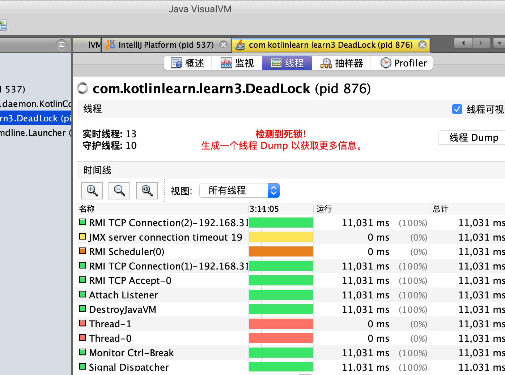
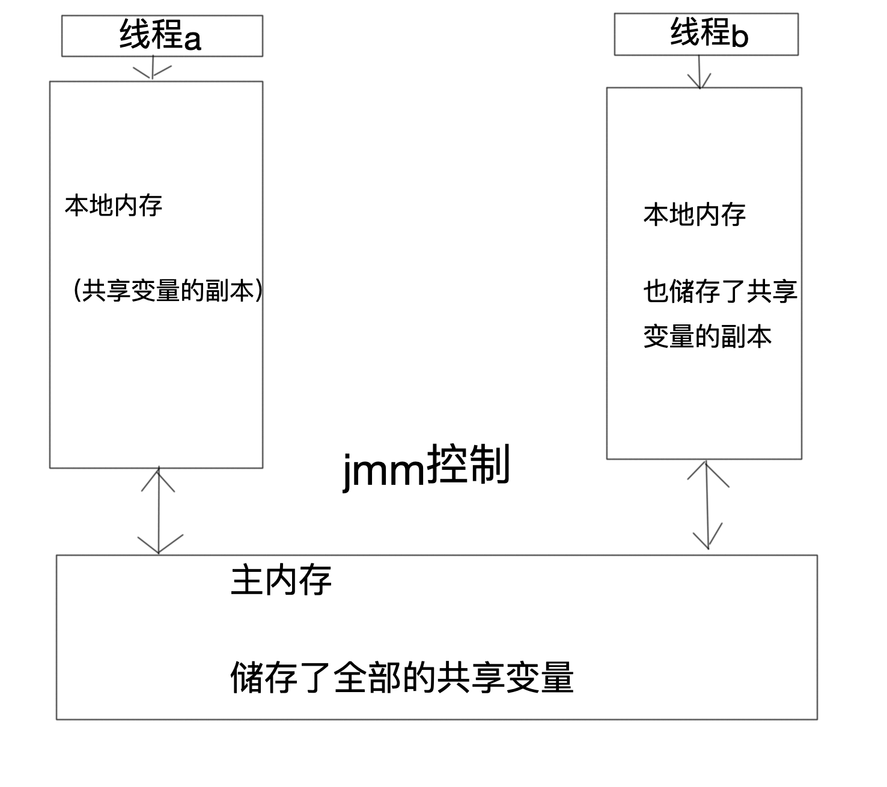

# Java并发编程的艺术

[TOC]


## 上下文切换的含义

一次上下文切换简单的理解就是，我这个线程正在做事呢，做一半要保存现在的状态等一会在回来继续做，这样一次切换就叫做一次上下文切换

## 多线程一定比单线程快么？

不一定，如果两件事分别开辟两个线程去做，但是这两个线程在不停的切换上下文，导致其实还是在单线程的做事，那么加上上下文切换的成本他一定是比单线程要慢的。

## 死锁

写一个死锁的代码

```
/**
 * 这里我们设计两个锁对象，并且启动两个线程，其中第一个获取a锁之后不释放锁直接去请求b锁
 * 第二个则直接请求b锁在不释放锁的情况下请求a锁
 */
public class DeadLock {
    private static String a = "a";
    private static String b = "b";

    public static void main(String[] args) {
        new DeadLock().deadLock();
    }

    public void deadLock(){
        new Thread(new Runnable() {
            @Override
            public void run() {
                synchronized (a){
                    try {
                        Thread.sleep(2000);
                    } catch (InterruptedException e) {
                        e.printStackTrace();
                    }
                    synchronized (b){
                        System.out.println("111");
                    }
                }
            }
        }).start();
        new Thread(new Runnable() {
            @Override
            public void run() {
                synchronized (b){
                    try {
                        Thread.sleep(2000);
                    } catch (InterruptedException e) {
                        e.printStackTrace();
                    }
                    synchronized (a){
                        System.out.println("222");
                    }
                }
            }
        }).start();

    }

}
```



通过jvm检测工具可以清楚的看到出现了死锁

## volatile关键字

volatile关键字是一个轻量级的并发操作，他要求被volatile关键字修饰的变量，会保持他的数据的可见性，也就是说在一个线程修改这个变量时，对于其他线程这个是可见的。保持Java线程中这个变量是一致的

## volatile是如何保证可见性的呢？

通常我们修改一条数据会先把修改后的数据存在cpu缓存中，而被volatile修饰的数据会给cpu发送一条额外的指令，要求cpu将修改后的数据立马放入到内存中，其他线程会发现他的缓存数据无效了然后在执行的时候会强制填充缓冲行重新拿数据

## synchronized关键字的原理和应用

Java中的每一个对象都可以作为锁。具体表现为以下三种

1. 普通同步方法，锁是当前实例对象
2. 静态同步方法，锁是当前类的class对象
3. 同步方法快，锁是括号里的对象

synchronized实现基于cpu的内存屏障（monitor）

当编译时会在synchronized包含的代码块或是方法头部插入一个monitorenter，在尾部插入一个monitorexit，当程序运行时执行到monitorenter时cpu会尝试获取他的monitor权限也就是获得锁，当执行monitorexit会释放权限。

synchronized代码块使用的锁是放在Java对象的对象头中的。

| 长度  | 内容                   | 说明                           |
| ----- | ---------------------- | ------------------------------ |
| 32/64 | markword               | 储存对象的hashcode和锁信息等   |
| 32/64 | class metadata address | 储存对象类型数据的指针         |
| 32/64 | array length           | 数组长度（如果对象是一个数组） |

Java头对象中的markword储存了hashcode和分代信息还有就是锁标记位

### 锁升级与对比

Java1.6为了减少锁获得，和锁释放的性能消耗，引入了偏向锁和轻量级锁。在Java1.6中锁一共有四种状态分别是：无锁状态，偏向锁状态，轻量级锁状态和重量级锁状态。锁的状态会因为竞争变得强烈而升级为更高级的锁状态。锁可以升级但是不能降级。这个只能升级不能降级的策略是为了将强获得锁和释放锁的效率。

锁升级也会改变markword里面的锁标记位

### 偏向锁

在大多数情况下锁是不需要竞争的往往是同一个线程多次获得锁。位了减小一个线程获得锁的消耗引入了偏向锁，也就是在锁对象的栈帧和markword中储存偏向的进程ID。

只有在另一个线程真正的来和这个线程竞争锁的时候才会释放锁否则就叫偏向的线程一直持有锁。

### 轻量锁


## 原子操作的实现原理

意为不可以被分割或者中断的一个或者一系列操作

### cpu如何实现原子操作

一。总线锁保证原子性

总线锁就是当一个cpu对某个数据执行读改写操作时，会向系统发送一个lock#信号，将其他的线程阻塞在外。

二。使用缓存锁实现原子性


### Java如何实现原子操作

在Java中可以使用循环cas和锁来实现原子操作

从java1.5开始jdk并发包引入了一系列的原子类型的对象来支持原子操作

cas实现原子操作三大问题

1. aba问题如果一个字符原来是a被改为了b又被改为了a那么cas操作是不会认为他被修改过的，这个问题的解决方法就是对数据将上一个版本号，被修改一次就加1版本号
2. 循环时间长开销大，循环cas如果长时间不成功那么就会给cpu带来很大的压力
3. 只能保证一个共享变量的原子性，如果我们要实现一个同时对一系列数据更改的操作保持原子性那么cas就不能实现了，我们可以使用锁来实现，当然也可以吧这一系列数据放入一个对象然后对着一个对象进行cas操作

## Java内存模型

在并发编程中需要我们处理的两个关键性的问题

线程与线程之间的通信如何同步：共享内存，消息传递

在Java中选择的是显性的共享内存并且隐性的传递消息的方式

在Java中所有的实例域，静态域和数组元素都是创建在堆上的，而堆内存在线程之间是共享的。而局部变量，方法的定义参数和异常捕捉参数他们是非线程共享的，他们不会出现内存可见性问题。也不受内存模型的影响。

```Java a
public class concurrenttest1 {
    public static void main(String[] args) {
        testt t = new testt();//这里我们通过实例化对象主动使用testt这个类来使这个类被加载并初始化
        //我们来看一下myexception会不会被初始化
        //结果是不会被初始化的
        //我们调用静态方法看一下
        try {
            testt.tt();
        } catch (com.nettylearn.Service.myexception myexception) {
            myexception.printStackTrace();
        }
        //会发现实在catch的过程中被初始化的
    }
}

class myexception extends Exception{
    static {
        System.out.println("init myexcepiton");
    }
    public myexception(String message) {
        super(message);
    }
}
class testt{
    public static void tt() throws myexception {
        throw new myexception("myeceoption");
    }
}
```

Java之间的线程通信是有Java内存模型(jmm)控制的



所以如果线程之间想要通信的话就必须经过主内存也就是说是先讲自己的副本放入到主内存在让另一个线程看见修改后的主内存也就完成了通信

### volatile的内存语意

## java并发编程基础

### 线程优先级

在Java中可以通过一个整形成员变量priority来控制优先级（1-10）

可以通过setpriority（）来设置这个线程的优先级默认线程优先级是5，优先级高的分配的时间片比优先级低的分配的多。

### 线程的状态


### daemon进程

daemon进程是一种支持性进程，他主要是被用做程序后台的支持工作进程，也就是说，如果没有一个daemon进程那么虚拟机就会退出。

可以通过thread.setdaemon(true)来设置这个进程为支持进程。这个操作必须在进程启动前执行不能在进程执行中执行。

### 安全的终止线程

### 线程间的通信


## Java中的锁

