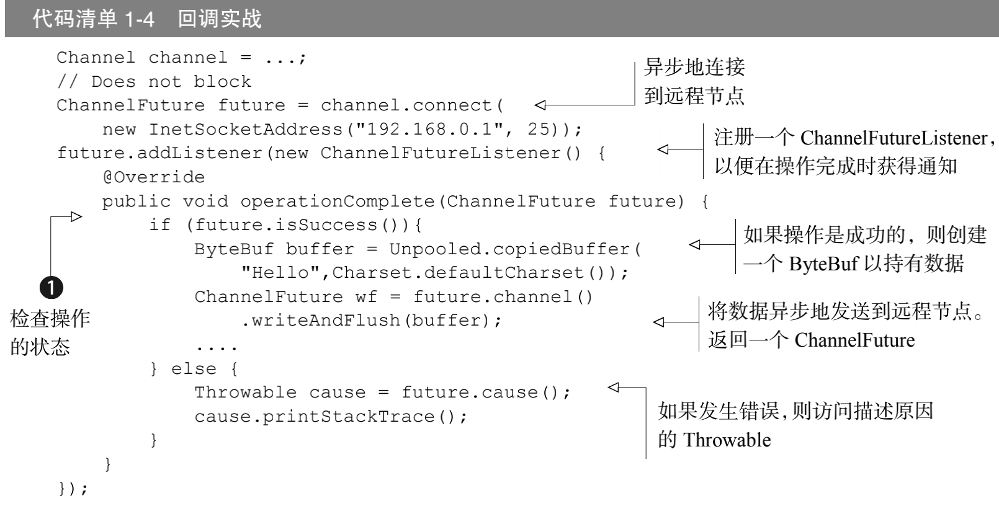
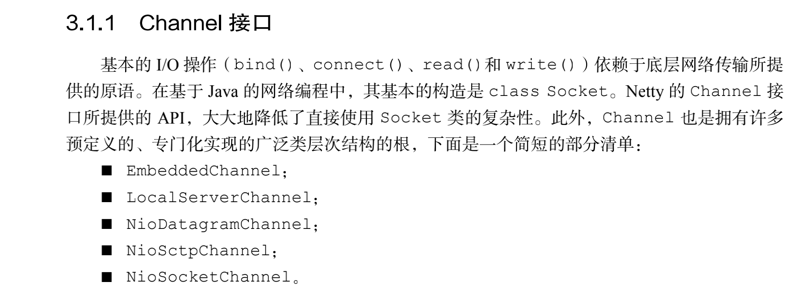
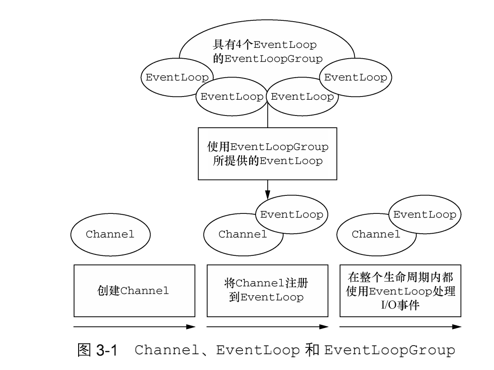
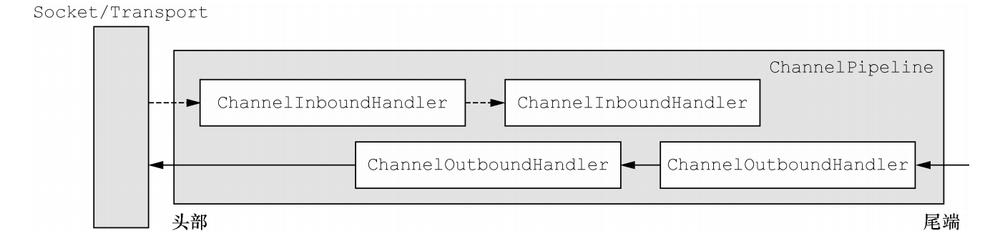
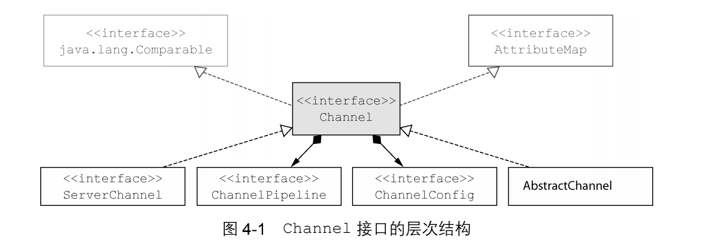
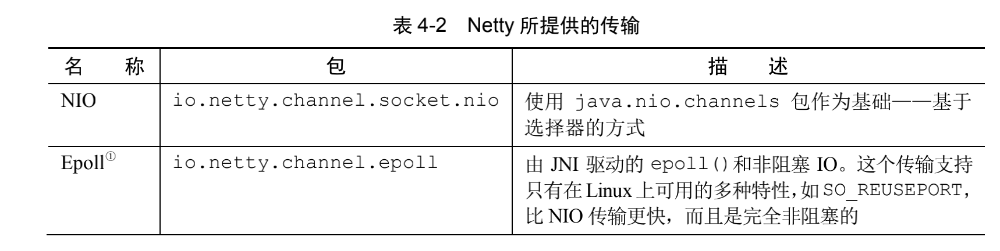
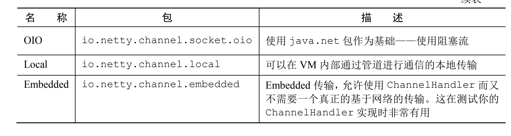
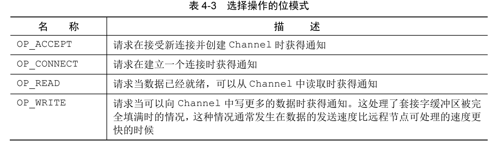
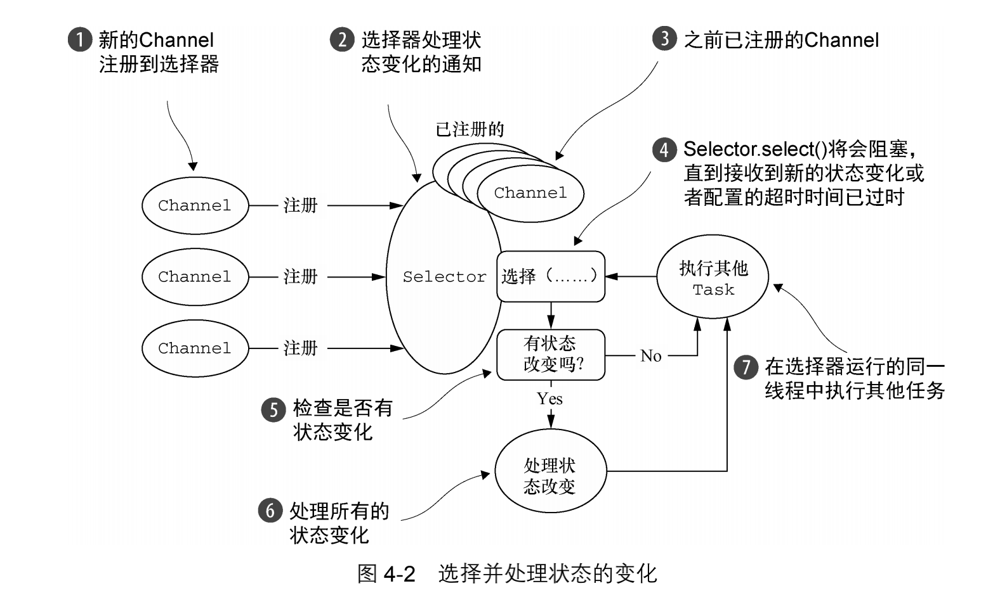

# netty实战读书笔记

[TOC]

# netty的概念和体系结构

## netty的核心组件

- channel
- 回调
- future
- 事件和handler

### channel

Channel 是 Java NIO 的一个基本构造。

它代表一个到实体（如一个硬件设备、一个文件、一个网络套接字或者一个能够执

行一个或者多个不同的I/O操作的程序组件）的开放连接，如读操作和写操作 

目前，可以把 Channel 看作是传入（入站）或者传出（出站）数据的载体。因此，它可以

被打开或者被关闭，连接或者断开连接。

### 回调

一个回调其实就是一个方法，一个指向已经被提供给另外一个方法的方法的引用。这使得后

者 可以在适当的时候调用前者。回调在广泛的编程场景中都有应用，而且也是在操作完成后通

知相关方最常见的方式之一。

### future

Future 提供了另一种在操作完成时通知应用程序的方式。这个对象可以看作是一个异步操
作的结果的占位符；它将在未来的某个时刻完成，并提供对其结果的访问。
JDK 预置了 interface java.util.concurrent.Future，但是其所提供的实现，只
允许手动检查对应的操作是否已经完成，或者一直阻塞直到它完成。这是非常繁琐的，所以 Netty
提供了它自己的实现——ChannelFuture，用于在执行异步操作的时候使用。
ChannelFuture提供了几种额外的方法，这些方法使得我们能够注册一个或者多个
ChannelFutureListener实例。监听器的回调方法operationComplete()， 将会在对应的
操作完成时被调用 ①
// Does not block
。然后监听器可以判断该操作是成功地完成了还是出错了。如果是后者，我
们可以检索产生的Throwable。简而 言之 ，由ChannelFutureListener提供的通知机制消除
了手动检查对应的操作是否完成的必要。
每个 Netty 的出站 I/O 操作都将返回一个 ChannelFuture；也就是说，它们都不会阻塞。
正如我们前面所提到过的一样， Netty 完全是异步和事件驱动的。

### 事件和channelhandler

### 手写http服务区

## netty的组件和设计

### Channel、EventLoop 和 ChannelFuture

正如我们已经解释过的那样，Netty 中所有的 I/O 操作都是异步的。因为一个操作可能不会

立即返回，所以我们需要一种用于在之后的某个时间点确定其结果的方法。为此，Netty 提供了

ChannelFuture 接口，其 addListener()方法注册了一个 ChannelFutureListener，以

便在某个操作完成时（无论是否成功）得到通知。

### ChannelHandler 和 ChannelPipeline

从应用程序开发人员的角度来看，Netty 的主要组件是 ChannelHandler，它充当了所有

处理入站和出站数据的应用程序逻辑的容器。

ChannelPipeline 提供了 ChannelHandler 链的容器，并定义了用于在该链上传播入站

和出站事件流的 API。当 Channel 被创建时，它会被自动地分配到它专属的 ChannelPipeline。

 一个ChannelInitializer的实现被注册到了ServerBootstrap中 

 当 ChannelInitializer.initChannel()方法被调用时，ChannelInitializer 将在 ChannelPipeline 中安装一组自定义的 ChannelHandler； 

 ChannelInitializer 将它自己从 ChannelPipeline 中移除。

如果事件的运动方向是从客户端到服务器端，那么我们称这些事件为出站的，反之

则称为入站的。

鉴于出站操作和入站操作是不同的，你可能会想知道如果将两个类别的 ChannelHandler 都混合添加到同一个 ChannelPipeline 中会发生什么。虽然 ChannelInboundHandle 和

ChannelOutboundHandle 都扩展自 ChannelHandler，但是 Netty 能区分 ChannelIn

boundHandler 实现和 ChannelOutboundHandler 实现，并确保数据只会在具有相同定

向类型的两个 ChannelHandler 之间传递。

当ChannelHandler 被添加到ChannelPipeline 时，它将会被分配一个ChannelHandler

Context，其代表了 ChannelHandler 和 ChannelPipeline 之间的绑定。虽然这个对象可

以被用于获取底层的 Channel，但是它主要还是被用于写出站数据。

在 Netty 中，有两种发送消息的方式。你可以直接写到 Channel 中，也可以 写到和 Channel

Handler相关联的ChannelHandlerContext对象中。前一种方式将会导致消息从Channel

Pipeline 的尾端开始流动，而后者将导致消息从 ChannelPipeline 中的下一个 Channel

Handler 开始流动。

接下来我们将研究 3 个 ChannelHandler 的子类型：编码器、解码器和 SimpleChannel

InboundHandler<T> —— ChannelInboundHandlerAdapter 的一个子类。

### 编码器和解码器

## 传输

### 传输api

传输api的核心就是之前我们学习的channel接口的继承类，毕竟channel是负责连接的组件。

如图所示，每个 Channel 都将会被分配一个 ChannelPipeline 和 ChannelConfig。

ChannelConfig 包含了该 Channel 的所有配置设置，并且支持热更新。由于特定的传输可能

具有独特的设置，所以它可能会实现一个 ChannelConfig 的子类型。（请参考 ChannelConfig 实现对应的 Javadoc。）

### 内置的传输

Netty 内置了一些可开箱即用的传输。因为并不是它们所有的传输都支持每一种协议，所以

你必须选择一个和你的应用程序所使用的协议相容的传输。

接下来我们将详细的学习这几种传输

### nio

NIO 提供了一个所有 I/O 操作的全异步的实现。它利用了自 NIO 子系统被引入 JDK 1.4 时便

可用的基于选择器的 API。

选择器背后的基本概念是充当一个注册表，在那里你将可以请求在 Channel 的状态发生变

化时得到通知。可能的状态变化有：

 新的 Channel 已被接受并且就绪； 

 Channel 连接已经完成； 

 Channel 有已经就绪的可供读取的数据； 

 Channel 可用于写数据。

选择器运行在一个检查状态变化并对其做出相应响应的线程上，在应用程序对状态的改变做

出响应之后，选择器将会被重置，并将重复这个过程。

### epoll(用于 Linux 的本地非阻塞传输)

### 用于 JVM 内部通信的 Local 传输

## ByteBuf

