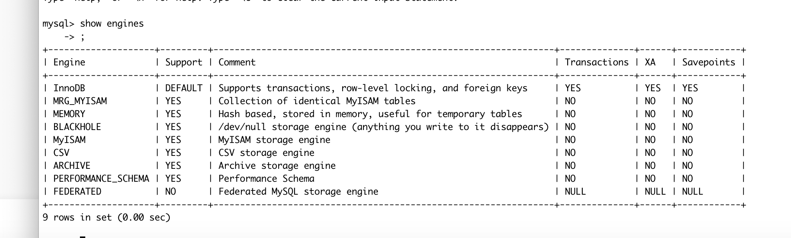

# MYSQL高级部分学习

这里我使用docker构建的mysql容器进行学习

首先进入mysql容器

caohao@caohaodeMacBook-Pro ~ % docker exec -it mysql5.7 /bin/bash

root@a9ed5bc9818a:/# mysql -u root -p. 登陆mysql

通过set password可以设置密码，不过我在构建容器时通过docker -e 设置了自己的密码这里就不操作了。

注意要登陆远程mysql刚刚安装时是没有授权的，要先授权远程登录并且弄好防火墙像是阿里云服务器的话只开启防火墙相应端口的话是不可以的，要到安全设置组里添加端口才可以。这里我弄了好久才发现

## 索引学习

### 索引的概述

**索引是帮助mysql进行高效查询的一种数据结构。**

在不建立索引的情况下数据库信息就是一个普通的表，我们查询数据时就要进行遍历，如果我们恰巧查询最后一个记录那么就要遍历到最后一个结果只拿到了一条数据，这种全表扫描效率比较低。

建立索引之后，我们的索引就会对表机构的字段建立一种数据结构就拿我们之前学过的树结构来说，二叉树的话去查询就比连表结构查询效率高得多。

### 索引的优劣势

优势

- 就像是书的目录可以加速查询，降低检索消耗
- 可以通过索引快速排序，降低排序成本，降低损耗

劣势

- 索引本身也是要占用空间的。本质来说他也是一张表
- 索引虽然增大了查询效率但是，我们对索引的维护也会要更大的精力当我们对原表进行更新时也要对索引表进行更新。

### 索引的结构

#### **btree**结构

b树的特性：一颗m叉b树的特性如下

1. 树的每个节点最多有m个孩子
2. 除了根节点和叶子结点，每个节点至少包含m/2向上取整个孩子
3. 若根节点不是叶子结点，则至少有两个孩子
4. 所有叶子结点都在同一层
5. 每个非叶子结点由n个key和n+1个指针组成其中(m/2)-1<=n<=m-1

b树的特性是向上分裂和我们开始学的二叉树是向下分裂是不一样的，b树是在满足了条件之后，会对自己进行分裂并向上传递一个key如果上一层也满足了条件就也进行刚刚的行为，最后产生的树就是一个满足特性并且所有叶子结点都在同一行的b树

这样出来的数据就有一个很好的分区，当进入查找时这种浅层次的树会比二叉树更高效。并且他的分区会更细。

具体的演变过程在我的算法导论读书笔记中有

#### b+tree索引结构

b+树与b树的区别：一个n叉b+树

1. 最多包含n个key，而b树是n-1个
2. b+树的叶子结点保存所有的key信息，按照key的大小进行排序
3. 所有的非叶子结点都可以看作是key的索引部分

这个树给人的感觉就像是树和连表的结合，我们学的数组和链表结合的map 就跟这个差不多

这个树查询是通过非叶子结点对数据进行分区，找到在某一个范围内的数据群，进到群里去找，就减少了查询的次数。

**mysql的索引就是优化后的b+树是一个带顺序指针的b+树**

**这个链表是在叶子结点之间互相连接的作用，这样的话如果我要的数据是多个并且他们不在一个数据群中，就可以直接在一个叶子结点中通过指针到下一个数据群中去拿，这样就不用在进行一次从树顶到叶子的查询了**

### 索引的分类

- 单列索引：每一个索引对应一列
- 唯一索引：如果这一列的值是唯一的，就可以通过这个咧进行建立索引
- 复合索引：对多个咧组合建立索引

### 索引创建与使用

语法：create [索引类型] index index_name [using   index_type]. On tbl_name (index_clo_name .....)

注意mysql默认对主键创建一个索引

Create index index_user on user(user_name)

show index from user 查看user表建立的索引 可以看见系统自动对主键创建的索引

删除索引

drop index index_user on user 删除user表的index_user 索引

alert命令

Alert 

### 索引的设计原则

我们通常对查询频次较高，数据较多的表进行索引建立

我们一般针对经常在where子句出现的字段进行列索引建立

尽量使用唯一索引，区分度越高索引的效率越高

索引并不是多多益善，要适当的使用，毕竟索引也需要我们去维护，当一个表有着巨大的改动频率时尽量不要建立索引了

尽量使用短字段索引

我们可以建立一个组合索引，来减少索引的数量

## 视图

### 概述

视图就是一种虚拟的表，视图时并不存在于数据库中的表，他所封装的是一个实现创建好的s q l语句的集合，我们查看一个创建好的视图其实就是，数据库自动调用这个sql语句。

优点

- 简单：我们使用视图时不用去关心他的底层sql语句的构造，在调用视图的人看来他所操作的就是一个单表操作
- 安全：对于数据库层面来看来说有些表的字段是不想要开发人员看到的，那么就可以使用视图，构造一个虚拟的多表联合的表既能满足开发人员的需求，又能减少风险
- 数据独立：一旦视图的结构确定了，就可以屏蔽表结构修改对视图的影响

### 基本语法

创建：

create view view_name [(column_list)]

As select_statement

```
create view view_city_home as select city_name ,city_id,from city where ...
```

修改：

我们修改视图中的数据时修改的其实是基础表的信息，毕竟视图只是一个sql语句的集合

alert view view_name 。。。

查看视图

在mysql57以后使用show tables就可以看到表和视图了，不存在show views这个命令

删除视图

drop view  [if exists] viewname 

## 存储过程和存储函数

### 概述

存储过程和存储函数都是一段sql语句的集合，使用存储过程和存储函数能减少开发人员的工作量。减少应用程序和数据库的交互

举个例子：假如说现在有一个查询需求会前前后后使用三条sql语句，如果在服务端通过sql语句去执行拿到返回结果那么就要和数据库交互3次而如果事先将这三个语句的集合存在一个存储函数中那么服务端只要调用这个函数就可以直接拿到返回值，这样就是只和数据库交互了1次

函数：一个有返回值的过程

过程：是没有返回值的函数


### 语法

创建

create procedure procedurename。

begin

【s q l语句】

end

```
create procedure p_test 
begin
select * from city 
end ;
```

调用

Call procedurename() ;

Call  p_test();

查看

show procedure  status

show create procedure pro_name 查看创建这个存储过程的语法

删除

drop procedure procedurename


## 触发器

### 介绍

顾名思义，触发器就是当满足某种状态时自动执行的一系列sql语句。

比如说集连删除，这种。都可以通过触发器实现


## mysql体系结构


## 存储引擎

### 概述

存储引擎是在mysql中的一个概念，可以针对不同的要求选择不同的存储引擎，存储引擎是针对于表的而不是库，你在建立一个表的时候可以选择自己要的存储引擎。它的功能就是存储数据，建立索引，更新列数据等等技术的实现方式，不同的存储引擎他对各种功能的实现方式不同，有不同的优缺点。

5.0之后存储引擎默认使用innodb

查看支持的存储引擎

show engines



### 存储引擎的特点

| 特点     | Innodb                 | Misaim |
| -------- | ---------------------- | ------ |
| 事务安全 | 支持                   | 不支持 |
| 锁机制   | 支持行锁（适合高并发） | 表锁   |
| 支持外键 | 支持                   | 不支持 |

### 选择原则

## 优化sql步骤


