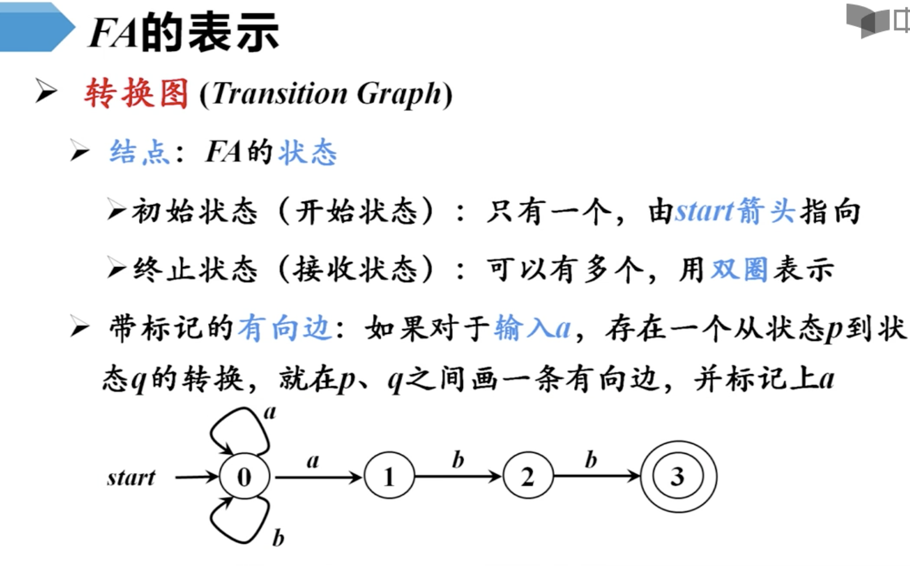
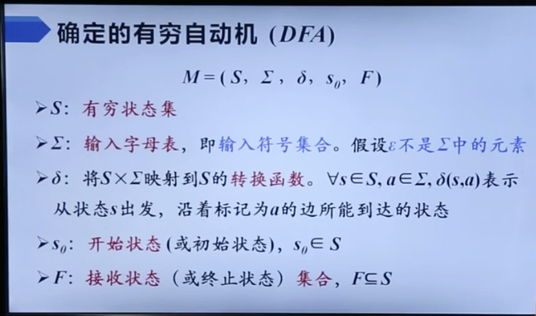
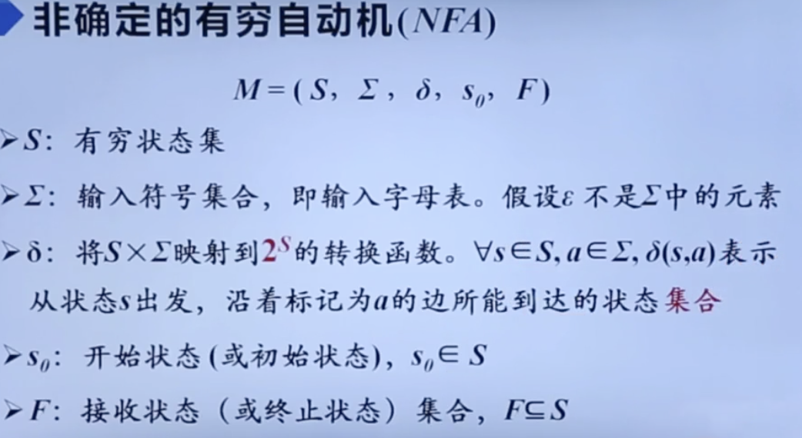
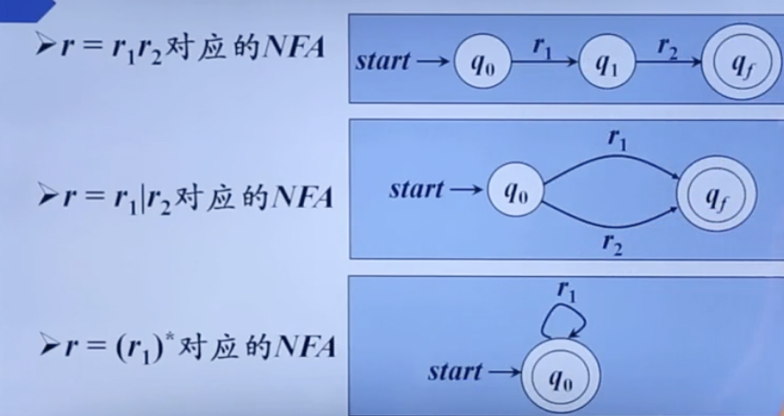
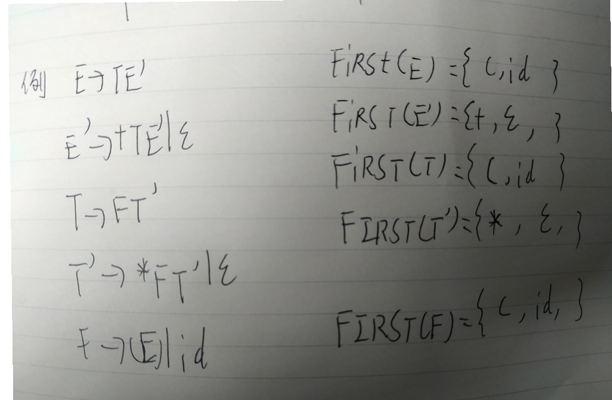

# 基本概念

我们平时所写的代码都并不是机器语言那么这是如何被电脑所解析的。

这样看这里面一定会有一个将目标高级语言转化为机械语言的过程，这个过程可能会被电脑交给一个专门完成这个工作的员工去做。这个员工可以叫他编译器。

想一想，我们平时想要看懂一个英文句子，首先我们一定是能够读懂句子里面的单词的，之后我们就会对这个句子按照一定语法进行分析将各个短语翻译出来，最后我们就会将这个句子的整个意思写出来。

这个过程可以看成高级语言翻译为一个目标语言的过程

词法分析->语法分析->语义分析

但是在实际过程中还要比上面这个过程稍微复杂一点

词法分析->语法分析->语义分析->中间代码生成器->代码优化器->目标代码生成器->机器语言的代码优化

这里面中间代码就像是我们之前所学的桥接模式中那个桥的概念。她负责将两个无关的语言结合起来，就像是一个中间的存储站一样一中间代码的形式存储语义，然后把这个中间代码交给下面的人让他们去将这个语义生成为机器语言并做一些优化比如是语法顺序之类的。


# 词法语法分析

当我们想要编译器能够自动的对一个高级语言进行解析编译的话我们一定会需要一个表来存储一些词法，就像是26个英文字母的字母表一样只有在了解了这些字母之后才能将由字母组成的语句翻译过来

## 字母表

**这个表就是字母表**

字母表可以看作是一个字符串的集合，{A,B,C,D}这就是一个长度为4的字母表

字母表之间也存在运算，比如字母表A={1,2} B={3,4}那么AB={1，3}，{1，4}，{2，3}，{2，4}

A的3次幂则={1,2} {1,2} {1,2}={111,112,121,122,211,212,221,222}这么看字母表A的3次幂就是长度为3的字符串的集合

字母表的正闭包：字母表上长度为正的字符串集合

字母表的克林闭包：在正闭包的基础上加一个空串

## 文法

G=(Vt,Vn,P,S)

Vt：终结符集合

Vn：非终结符集合

P：产生式集合

S：开始符号


## 文法的分类

**0型：无限制文法**

对于产生式没有限制仅仅要求产生式左部必须包含一个非终结符

**1型：上下文有关文法**

在0型文法的基础上进一步要求左边的符号的个数不能多于右边的个数（不包含空产生式）

**2型：上下文无关文法**

要求产生式左边必须是一个非终结符

**3型：正则文法**

右线性文法：在上面的基础上进一步要求右边部分表达式的右面包含一个非终结符要么就没有终结符

左线性文法：这个和上面那个正好相反

**总结：我们可以看出这四种文法从上到下是逐渐增大限制的过程，也就是说从上到下也是一个包含的过程，型的范围最大包含下面的所有文法，像这样1包含23，2包含3依次向下**

如果我们进一步分析正则文法就会发现她所构建的语言可以描述基本上所有的单词，而上下文无关文法则能够很好的描述句子的构造

## cfg的分析树（上下文无关文法）


## 正则文法

正则表达式(RE)

一种用来描述正则语言的方法

例：假如说一个字母表包含{a,b}，那么

L(a|b)={a,b}

L((a|b)(a|b))={a,b}{a,b}={ab,aa,ba,bb}

L(a*)={a}的克林闭包={空串,a,aa,aaa,....}

L(a|b)*={a,b}的克林闭包={空串,a,b,ab,ba,aab,abb.....}

## 有穷自动机



fa**定义或接收的语言**

如果输入一个串可以使得自动机从初始状态到某个终止状态，那么就说这个串是自动机可以被该自动机接收

而所有的可以被接收的串的集合就是这个自动机的语言

**最长子串匹配原则**

当输入串的多个前缀和一个或者多个模式匹配时，总是选择最长前缀进行匹配

## 有穷自动关机的分类

- 确定有穷自动机    dfa
- 不确定有穷自动机







从上面的图可以看出，dfa和nfa之间的区别仅仅在于dfa在输入一个字母时只能到达一个状态，而nfa在输入一个字母时可能有两种不同的状态可以到达。

## **从正则表达式到有穷自动机**

由于直接从re到dfa是比较困难的，所以我们一般都是先将其转换为nfa之后再从nfa转换到dfa




## **从nfa到dfa**


## 习题


## 识别单词的dfa


## 词法分析程序实现

Java实现‘


kotlin实现


# 自顶向下的语法分析

从分析树顶部的根节点向下构造分析树就是自顶向下的语法分析方法

## 文法转换

#### 消除直接左递归

直接左递归：当一个文法中有这种a=ax｜b形式会导致自左向右的推导进入无限递归这样成这个文法为直接左递归

我们分析一下这个情况

```
a=ax
 =axx
 =axxx
 =....
 =a...x
 并且a=b
 那么我们可以将这个表达式看作一个a=b(x)*这样一个正则表达式
 也就是我们的a他可以推导出一个以b打头的x串
 a=ba'(a'=x*|空串)
 事实上这种消除的过程就是将左递归变为右递归
```

下面我们引入一道练习题

```
s->Aa|b
A->Ac|Sd|空串
我们现在来消除他的间接左递归

```

提取左公因子

```
s->aAd|aBc
A->c
B->b
我们可以看到S的推导式中有公共的部分这种情况我们可以将公共部分提取作为一个S'
s->as'
s'->Ad|Bc
A->c
B->b

```


## 下推自动机（pda）

## ll(1)文法

#### s_文法

每个表达式的右边都以终结符开始

同一个非终结符的各个候选式的首部非终结符都不同

不包含空串产生式

#### 后继符号集

可能在某个巨型中紧跟在A后面的终结符a的集合，记作FOLLOW(A)

#### 产生式的可选集

产生式的可选集是指在使用该产生式时可以输入的符号的集合

如A->B的可选集记作SELECT(A->B)

### FIRST和FOLLOW集的计算

FIRST（X）集是可以从X推导出的所有串首终结符的集合

找某个非终结符的first集合就到他的规则里去找第一个终结符



计算上面例题的follow集

查找某个非终结符的follow集那么就到规则里去找有这个非终结符的规则如果他的后面跟着一个字符那么就把它或者他的first集合放入，如果他的后面跟着的first是个空串，或者没有跟字符那么就把他的左部字符的follow集合填入

```
fllow(e)={),#}
fllow(e')=fllow(e)={）,#)}
fllow(t)=first(e')ufllow(e')ufllow(e)={+,）,#)}
follow(t')=follow(t)={+,),#}
follow(f)=first(t')ufollow(t)ufollow(t')={*,+,),#}
```

### 构造预测分析表

把某个非终结符的first集合对应的地方填入对应非终结符的规则，如果这个first有空串，那么就到他的follow集合中的对应的输入字符地方填入这个非终结符的规则

画出上面那个文法的预测分析表


如果一个文法的预测分析表没有多重定义的元素，则称这个文法为ll(1)文法


# 自底向上的语法分析

使用最左归约分析

最常用的是移入-归约分析法

