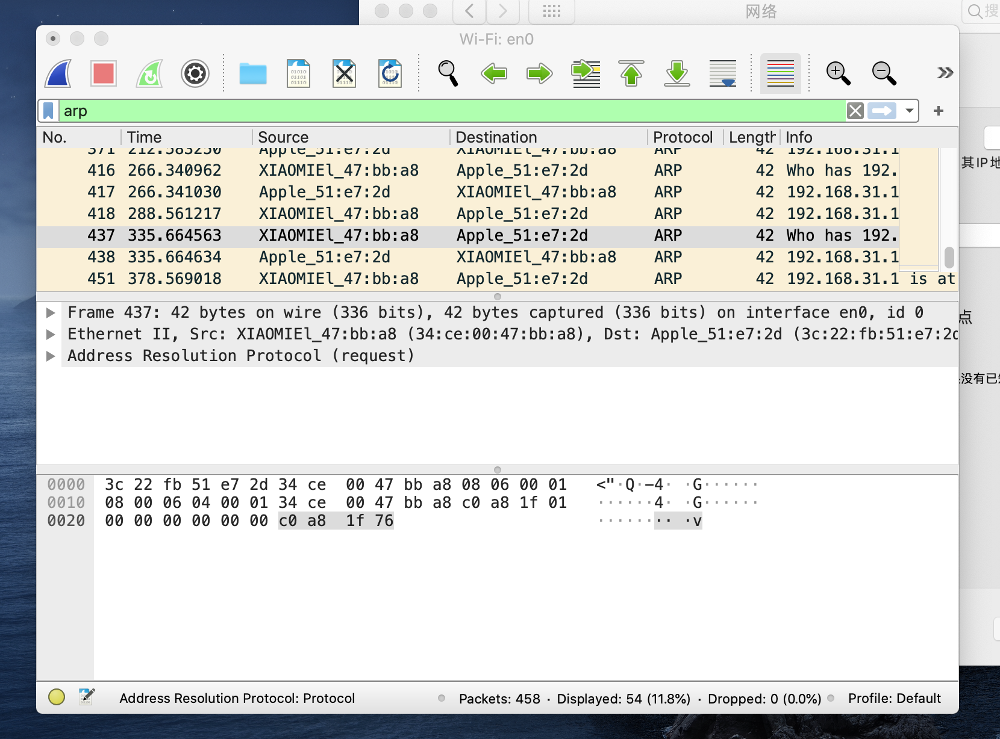
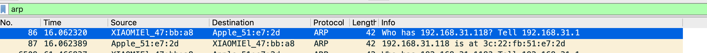
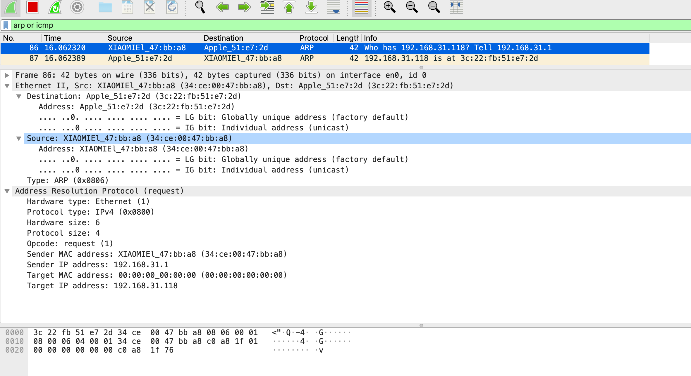
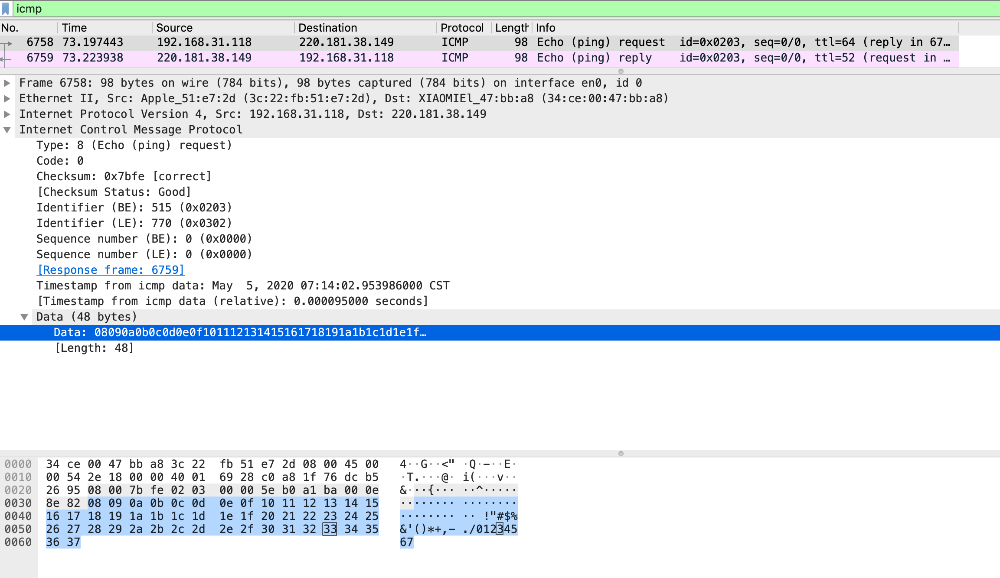
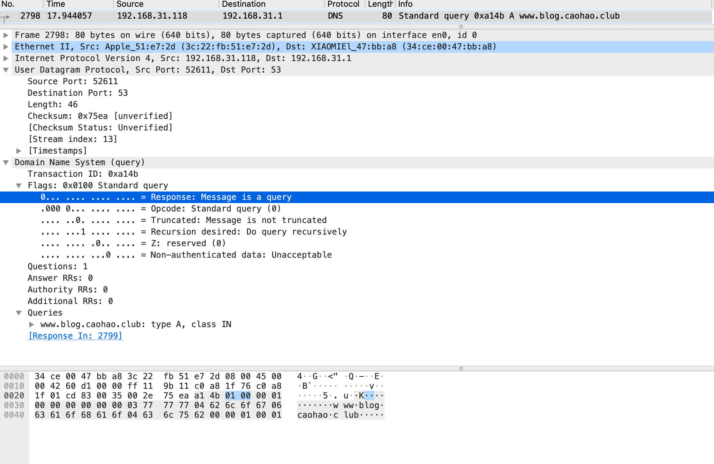
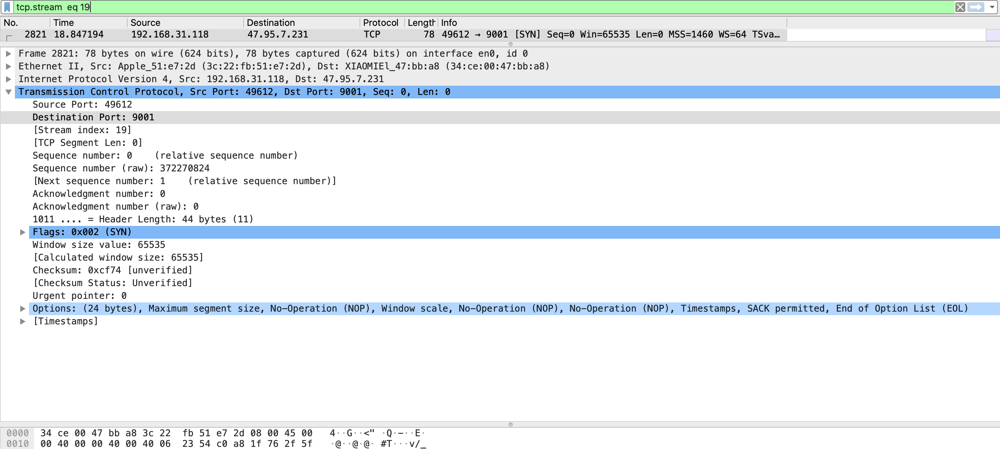
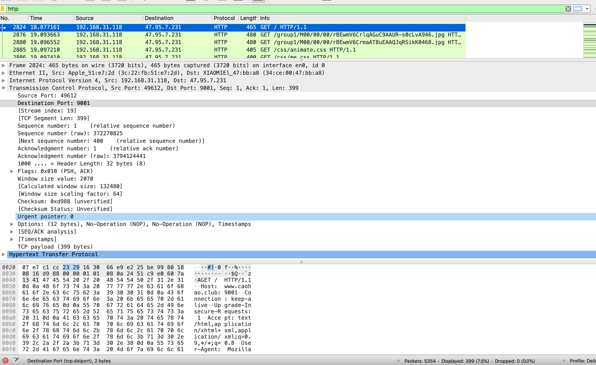
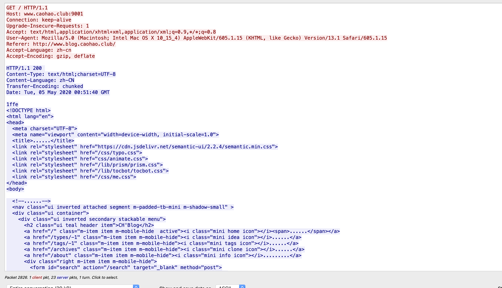

#### The capture session could not be initiated on interface 'en0' (You don't have permission to capture on that device).错误解决办法

```
caohao@caohaodeMacBook-Pro ~ % cd /dev
caohao@caohaodeMacBook-Pro /dev % ls -la | grep bp
crw-------   1 root    wheel           23,   0  5  4 21:18 bpf0
crw-------   1 root    wheel           23,   1  5  4 21:18 bpf1
crw-------   1 root    wheel           23,   2  5  4 21:18 bpf2
crw-------   1 root    wheel           23,   3  5  4 21:18 bpf3
caohao@caohaodeMacBook-Pro /dev % sudo chown caohao:admin bp*
Password:
caohao@caohaodeMacBook-Pro /dev % ls -la | grep bp
crw-------   1 caohao  admin           23,   0  5  4 21:18 bpf0
crw-------   1 caohao  admin           23,   1  5  4 21:18 bpf1
crw-------   1 caohao  admin           23,   2  5  4 21:18 bpf2
crw-------   1 caohao  admin           23,   3  5  4 21:18 bpf3
```

这个问题是由于权限所导致的通过上面的配置重新打开Wireshark就可以了

## 界面分析



从上到下解释一下界面

绿色的搜索条是一个可编辑的过滤器，可以按照我们输入的条件过滤已经被抓到的包

在下面那个黄色窗格显示的是所有的符合条件的包

在下面那个有英文字母的是你选择的包的详细信息

最底下的是二进制加密的包数据

## 分析一些简单的协议

### arp(地址解析协议)

首先清理一下arp缓存，

arp -a

查看arp缓存表

sudo arp -ad

清理缓存表



可以看到info一栏第一行是一个询问的请求第二行则是一个响应

第一行问谁是192。168.31.118 问的人是192.168.31.1

source这一栏是源地址 可以看到这是我家的路由器向我这台Mac询问地址

第二行我这台Mac给出了回复并且会将这个路由器的地址存在地址表中。



看倒数第二行的白色窗格，里面记录了传输过来的数据报

frame 这个是最外层的数据帧

ethernet ：以太网包，里面很明显有一个原地址和一个目标地址

在下面是一个arp包，可以看见有，硬件类型，协议类型是IPv4，硬件大小6协议大小4，类型则是请求，在下面是发送方的物理地址和IP还有接收方的物理地址和IP

### icmp(网络控制报文协议)的echo



上面这张图就是icmp的echo命令产生的数据包

Icmp通常是用来确认连接是否有问题的，所以我们也可以看到icmp包里面的data包都是放的一些撑数据大小的数据，不是一些有用的数据。

在icmp包中我们也可以直接看到他对应的响应包的位置，这个是Wireshark带来的便捷的功能

### dns



这个dns我看的是我自己的博客的域名解析数据包

可以看到这个也是像俄罗斯套娃一样最外面是数据帧再包着数据链路层的以太网数据，在里面包着网络层的IP协议报，在里面是传输层的udp（用户数据报协议）报文段，最后就是架设于应用层的dns域名解析协议的数据了。这里面有一段是比较重要的其他的我们看后面的说明就能看懂，图片里我标记蓝色的那个flags这一段数据对于dns协议来说就像是一系列的说明一样有着具体的要求和限制

### tcp三次握手



可以看到和上面udp差不多只不过东西更多了，包括原端口目的端口等。三次握手我们可以通过Wireshark的一个沿着tcp流的限制来查看。

可以看到几个用于判断握手的数据比如说syn,ark等。其实就是一个收到数据并++的过程来验证三次握手成功之后就会进入一个连接建立的状态之后就是进行具体的http传输的过程了

### http




作为一个java程序员很清楚的就能看到这个http请求建立的过程，并且也会发现这些数据是可以直接看见的，是一个明文传输。



### telent

