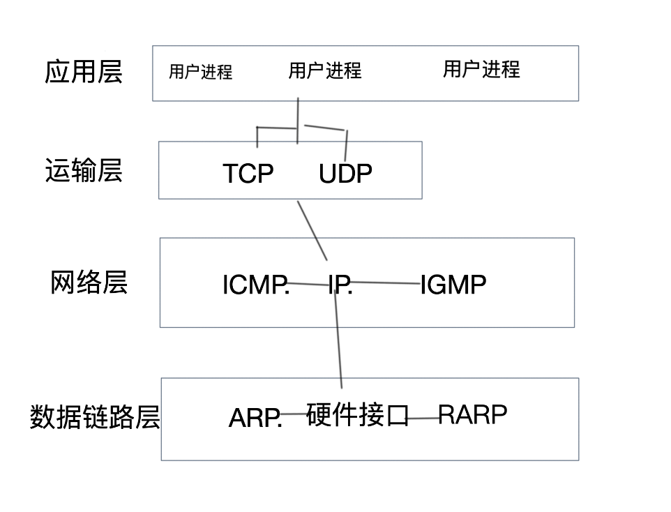
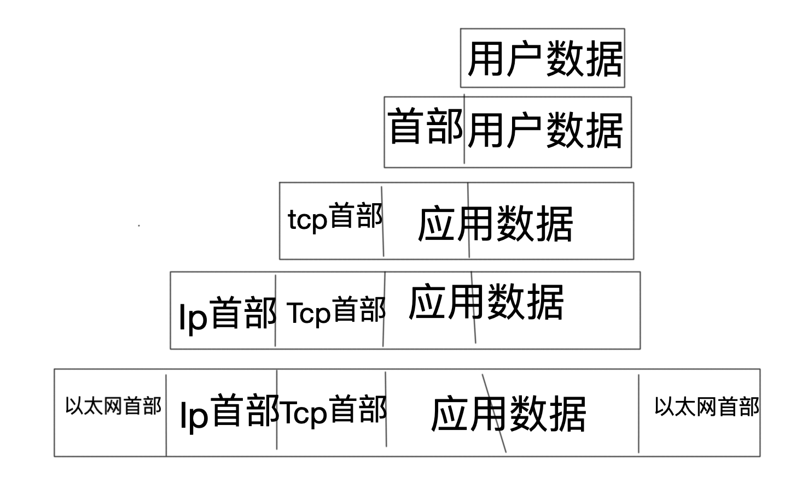
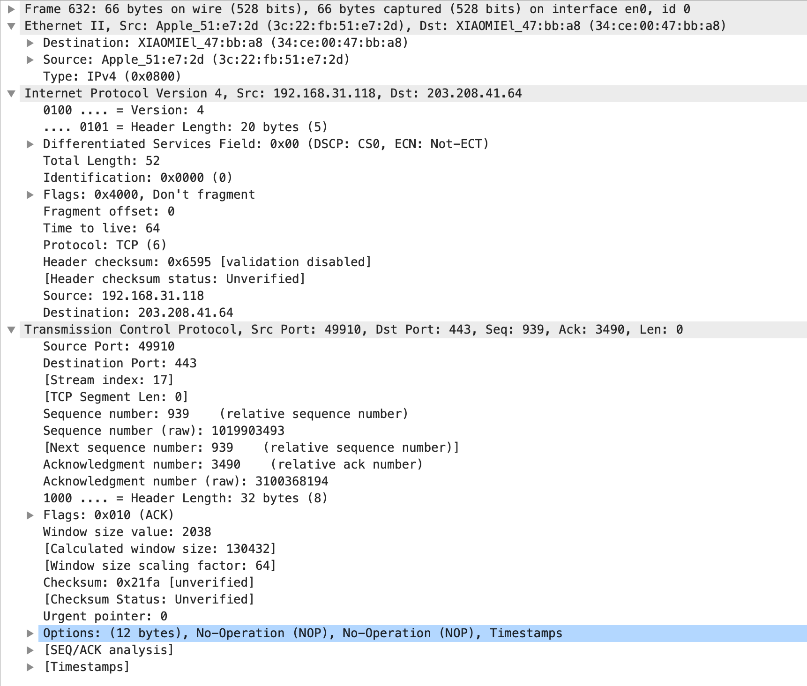

# Tcp/ip协议族中不同层次的协议

传输层：tcp/udp

网络层：ip/icmp/igmp

链路层：arp/rarp

# 封装

封装在计算机网络的多层协议中是一个很重要的概念。在一层一层自上而下传过来的信息会经过一层一层的封装（以太网最大的字节是1500个字节最短长度46，如果你的长度过长那么就要分片，比46短就要补0够了46才能发走），当底层接到一个数据帧时就会一层一层的剥离然后向上转发。

上面这个是一个简单的封装头部的过程

我们使用Wireshark抓取一个数据包看一下

上面是我们抓取到的一个tcp协议的数据包可以看到以太网帧里面是IP数据报在里面封装着tcp协议报

我们可以看到在以太网帧里面有一个数据是type=0x0800 ipv4

在IP数据报里有一行protocol=6. tcp

二tcp里有一个目标端口号port=443代表了是应用层的https协议

常见的一般有以下几种

| 以太网协议号 | IP:0x0800 arp:0x0806 pppoe:0x8863 0x8864                     |
| ------------ | ------------------------------------------------------------ |
| ip协议号     | Imp:1 tcp:6 ump:17 gre:47 esp:50 ah:51                       |
| 端口号       | Ftp:20/21 ssh:22 telent:23 smtp:25 tacacs+:49 http:80 https:443 ike:500 radius:1645/1646/1812/1813 |

